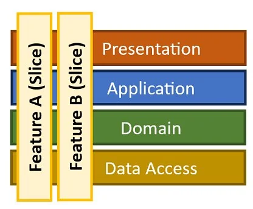

# VerticalSliceArchitecture
Sample project to demonstrate how to properly implement a vertical slice architecture. \
This project contains an API with two database connection to show how to handle multiple datasource while keeping your project clean and readable.

## What is a vertical slice architecture
A vertical slice architecture is way of building your API projects. It is based on organizing your code by features. \
\
Instead of splitting your app by Controllers, Request Handling, Request Models etc... You group everything needed in a single place. You can see that like cutting a slice of every stage of a cake. \
\

## Why using this architecture
It is very benefic for modern API because of its clarity, each functionalities are clearly separated and it is easier for you to create new functionalities.

## About this project
In this project you can find my own implementation of this architecture. \
\
I have decided to use my own libraries [DorApiExplorer](https://github.com/Neyzv/DorApiExplorer) which make an auto registration of your endpoints with a source generator, [MediaThor](https://github.com/Neyzv/MediaThor) which provides a source-generated, CQRS-friendly Mediator pattern with built-in support for dependency injection and also [Facet](https://github.com/Tim-Maes/Facet) by Tim Maes to provide source generated DTOs. \
\
In the `lib` part of the project you will find a 'Core' project named `VerticalSliceArchitecture.Infrastructure` which contains a bunch of utily classes to implement a new data source. And of cours the two data sources used in this project :
- In memory database : `VerticalSliceArchitecture.Infrastructure.InMemory`
- SQLite database : `VerticalSliceArchitecture.Infrastructure.Sqlite`
<!---->
\
In the base Infrastructure project you could find a custom implementation of the specification pattern, a seeding interface and also value converters. \
\
And in the API project the features and DTO models.

## Support me
If you like this project feal free to star this project.